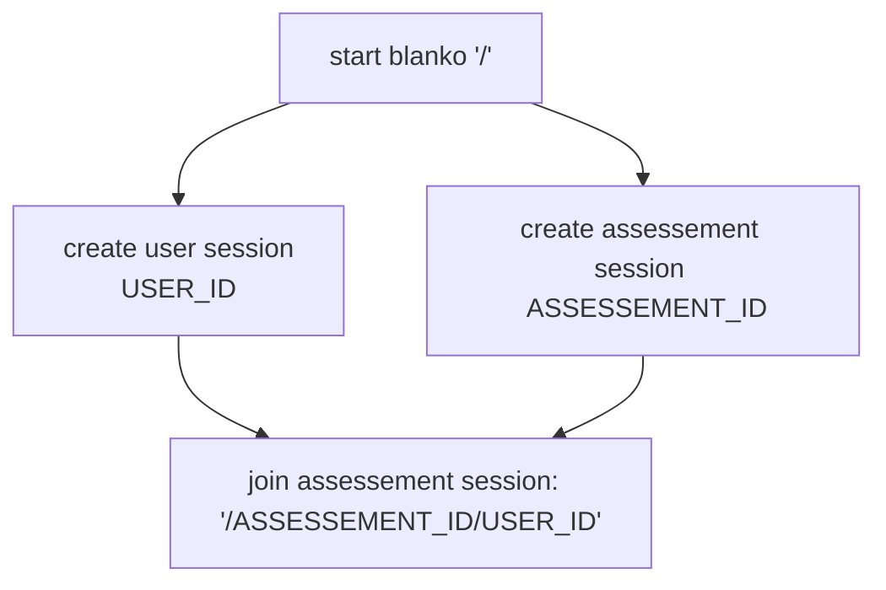
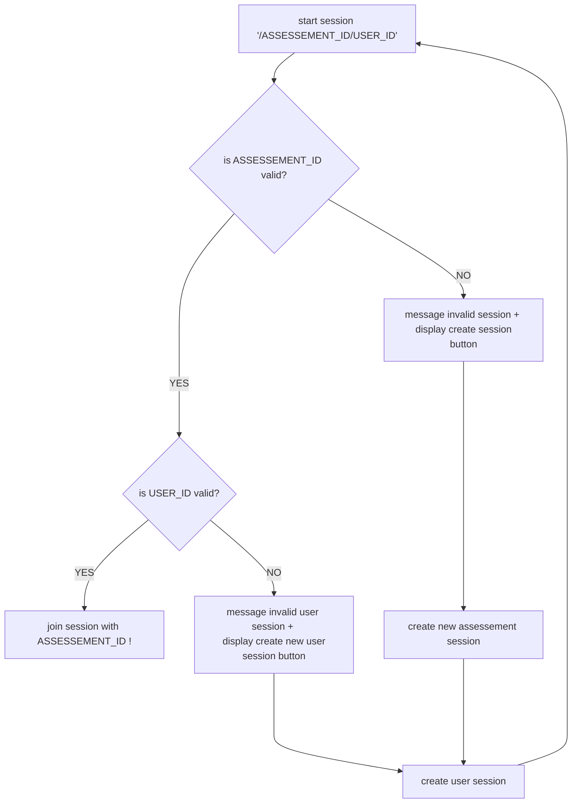

# jdgmnt

## create a new assessement session

```mermaid
flowchart TD
   A[start blanko '/'] --> B[create user session \n USER_ID]
   A --> C[create assessement session \n ASSESSEMENT_ID]
   B --> D[join assessement session:  \n'/ASSESSEMENT_ID/USER_ID']
   C --> D
```

## join an existing assessement session with an existing user session:

```mermaid
flowchart TD
  A[start session '/ASSESSEMENT_ID/USER_ID'] --> B{is ASSESSEMENT_ID valid?};
  B -- YES --> C{is USER_ID valid?};
  B -- NO --> E[message invalid session + \n display create session button];
  C -- YES --> D[join session with ASSESSEMENT_ID !];
  C -- NO --> F[message invalid user session + \n display create new user session button] ;
  F ----> G[create user session]
  G ----> A
  E ----> H[create new assessement session]
  H ----> G
```

